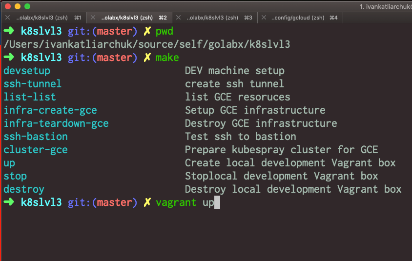
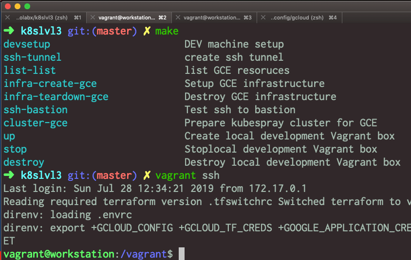
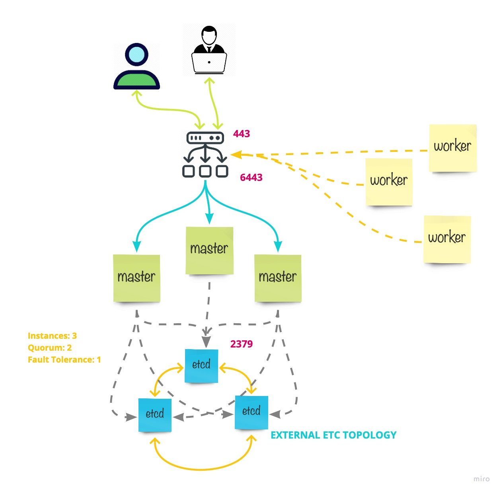

# Kuberentes at Master

<!-- START makefile-doc -->
```
$ make help
devsetup                       DEV machine setup
ssh-tunnel                     create ssh tunnel
list-gce                       list GCE resoruces
infra-create-gce               Task '2.1' > Setup GCE infrastructure for K8s cluster
cluster-gce                    Task '2.2' Provision kubernetes cluster for GCE with 'kubespray'
infra-teardown-gce             Task '13' > Tear down cluster with GCE infrastructure
ssh-bastion                    Test ssh to bastion
up                             Create local development Vagrant box
stop                           Stoplocal development Vagrant box
destroy                        Destroy local development Vagrant box
validate                       Validate pre commit
```
<!-- END makefile-doc -->

## Prerequisits

- [Docker](https://www.docker.com/why-docker)
- [Vagrant](https://www.vagrantup.com/)

## Project structure / Directory Layour

	.
	├── bin                         # scripts required to provision workspace & infrastructure
	├── data                        # store terraform parameters, ssh keys, kubeconf file
	├── images                      # images used in readme & docs
	├── kubespray                   # [kubespray](https://github.com/kubernetes-sigs/kubespray) project as submodule, forked from
	├── templates                   # templates used to create Vagrant box as well as provision infrastructure
	├── terraform                   # infrastructure-as-code terraform sources
		- cluster                     # cluster provisioning
		- gce                         # google cloud vendor related sources
		-- infrastructure
		- modules                     # infrastructure-as-code modules
		-- gce
		-- k8s
	─── .etidortconfig              # [project formatter](https://editorconfig.org/)
	─── .envrc                      # (load/unload](https://direnv.net/) project specific environment variables
	─── .pre-commit-config.yaml     # [framework](https://github.com/pre-commit/pre-commit-hooks) for manaing multi-language pre-commit hooks
	─── .tfswitchrc                 # [terraform version switcher](https://warrensbox.github.io/terraform-switcher/)
	─── Brewfile                    # [framework](https://docs.brew.sh/Homebrew-on-Linux) that help to install dependencies for current project
	─── Makefile                    # tells project what to do
	─── Vagrantfile                 # [describe](https://www.vagrantup.com/docs/vagrantfile/) what type of machine to build
	└── README.md                   # current file

All dependencies except docker & vagrant installed automatically on dev workspace.

## Setup Development Workspace

In root project folder, provision development environment with all the dependencies



SSH to the box so we can deploy cluster&provision infrastructure



```
vagrant up
vagrant provision
vagrant ssh
```

The workspace should have all the dependencies. There is one gotcha. Google cloud require authentication.
So at the mean time there is an explicit copy from users `~/.config/glcou` folder.

All required environment variables provided in `.envrc` folder. As well as terraform version is set in
`.tfswitchrc` folder. All plus optional dependencies are set via `Brewfile`. Supported operation versions are
Linux & MacOS. `Vagrantfile` support `Docker` as well as `Oracle VM (classic)` workspace provisioning.

## Cluster Architecture




## Create a new infrastructure environment

dependecies

python3 -m pip install --user virtualenv
pip3 install -r requirements.txt --user
pip3 uninstall -r requirements.txt -y --user
python
brew

```
python3 -m venv env
source env/bin/activate
export PATH="/Users/ivankatliarchuk/Library/Python/3.7/lib/python/site-packages:$PATH"
pip3 install jinja2-cli
```

SSH
UseDNS no
ClientAliveInterval 120
Subsystem       sftp    /usr/lib/openssh/sftp-server
AcceptEnv LANG LC_*
AllowAgentForwarding yes
https://www.digitalocean.com/community/tutorials/how-to-use-cloud-config-for-your-initial-server-setup
service ssh restart


PubkeyAuthentication yes
PasswordAuthentication no
ChallengeResponseAuthentication no


/etc/ssh/sshd_config


	docs
	https://www.vagrantup.com/docs/provisioning/file.html
